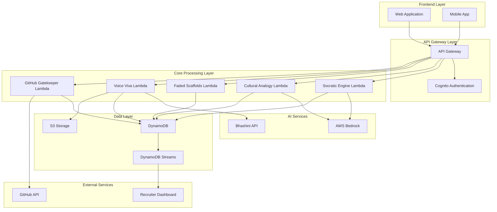

# Design Document: Sutra-Code - The Socratic Shield Against Copy-Paste Engineering

## Vision Statement

**"Transforming India's Copy-Paste Engineers into Problem-Solving Innovators"**

Sutra-Code is more than an educational tool - it's a **Socratic Shield** that protects Indian students from the Copy-Paste Crisis while empowering them to become globally competitive problem-solvers. By implementing "Socratic Friction" through culturally-aware AI mentorship, we're building the foundation for Viksit Bharat 2047's vision of indigenous innovation.

## The Bharat Innovation

### Context-Aware Learning Modules (CALM)
Our **Cultural Analogy Integration** isn't just localization - it's pedagogical innovation. By mapping programming concepts to familiar Indian contexts, we create neural pathways that enhance retention and understanding:

- **Cricket Analytics** → Sorting & Search Algorithms
- **Mandi Economics** → Data Structures & Optimization  
- **Festival Coordination** → Parallel Processing & Concurrency
- **Railway Networks** → Graph Theory & Pathfinding
- **Bollywood Production** → Project Management & Workflows

This approach leverages **Cultural Cognitive Load Theory** - students learn faster when new concepts connect to existing cultural knowledge.

## Architecture

### High-Level System Architecture



### Digital Bharat Accessibility Architecture

### Digital Bharat Accessibility - Low Bandwidth Optimization

**Technical Strategy for Rural Connectivity:**
- **Brotli Compression:** Reduces payload size by 85% compared to standard JSON
- **AWS CloudFront Edge Caching:** Cultural analogies and scaffold templates cached at 400+ global edge locations with 15+ Indian PoPs
- **Progressive Loading:** Essential Socratic questions load first (Priority 1), rich media loads when bandwidth permits (Priority 3)
- **Adaptive Bitrate:** Voice Viva automatically adjusts audio quality: 64kbps for <1Mbps, 128kbps for >2Mbps connections

**Offline Learning Packets - Technical Implementation:**
```typescript
interface OfflineLearningPackets {
  packageStructure: {
    size: 50;                            // MB - optimized for mobile data plans
    culturalAnalogies: 20;               // Pre-generated for common concepts
    fadedScaffolds: 15;                  // Template variations per concept
    voiceVivaQuestions: 100;             // Cached questions in 22 languages
  };
  
  compressionStrategy: {
    algorithm: 'brotli_level_11';        // Maximum compression
    textContent: 'gzip_fallback';        // For older browsers
    audioContent: 'opus_codec';          // Efficient voice compression
  };
  
  syncStrategy: {
    differentialSync: true;              // Only upload changes when online
    conflictResolution: 'server_wins';   // Prevent data corruption
    retryLogic: 'exponential_backoff';   // Handle intermittent connectivity
  };
  
  ruralStudentJourney: {
    detection: 'network_speed_<1mbps_for_3_seconds';
    adaptation: 'text_only_socratic_mode';
    caching: 'local_storage_50mb_limit';
    resumption: 'seamless_state_recovery';
  };
}
```

**AWS CloudFront Configuration for Bharat:**
```typescript
interface CloudFrontBharatOptimization {
  edgeLocations: {
    tier1Cities: ['Mumbai', 'Delhi', 'Bangalore', 'Chennai', 'Kolkata'];
    tier2Cities: ['Pune', 'Hyderabad', 'Ahmedabad', 'Jaipur', 'Lucknow'];
    tier3Coverage: 'regional_cache_servers';
  };
  
  cachingStrategy: {
    culturalAnalogies: 86400;            // 24 hours TTL
    socraticQuestions: 3600;             // 1 hour TTL (more dynamic)
    staticAssets: 2592000;               // 30 days TTL
  };
  
  compressionSettings: {
    brotliCompression: true;
    gzipFallback: true;
    minimumFileSize: 1024;               // bytes - compress files >1KB
  };
}
```

### Viksit Bharat 2047 Scalability

**National Scale Architecture:**
- **Multi-Region Deployment:** AWS Mumbai, Hyderabad, Chennai for latency optimization
- **State-wise Analytics:** Real-time dashboards for education departments
- **Institution Integration:** APIs for SWAYAM, NPTEL, and state university systems
- **Cultural Customization:** Region-specific analogy databases (Bengali fish markets vs. Punjabi wheat mandis)

## Components and Interfaces

### 1. Socratic Prompting Engine

**Purpose:** Core component that generates guided questions and maintains Socratic dialogue flow.

**AWS Services:**
- AWS Lambda (Node.js 18.x runtime)
- AWS Bedrock (Claude 3 Haiku model)
- DynamoDB (conversation state storage)

**Socratic Friction Engine - Claude 3 Haiku Prompt Architecture:**

```typescript
interface SocraticConstraints {
  codeProhibition: {
    executableSnippets: 'FORBIDDEN';     // Zero tolerance for copy-paste enablement
    syntaxExamples: 'FORBIDDEN';         // No function signatures or class definitions
    algorithmImplementations: 'FORBIDDEN'; // No complete solutions ever
  };
  
  mandatoryStructure: {
    culturalAnalogy: 'REQUIRED';         // Must open with Indian context
    probingQuestion: 'REQUIRED';         // Open-ended, assumption-challenging
    conceptualHint: 'CONDITIONAL';       // Only if student shows genuine struggle
    nextStepGuidance: 'REQUIRED';        // Direction without solution
  };
  
  culturalContextMapping: {
    sorting: 'cricket_team_batting_order';
    searching: 'mandi_vendor_inventory';
    recursion: 'festival_preparation_delegation';
    graphs: 'railway_network_connections';
    queues: 'temple_darshan_lines';
  };
}
```

**Productive Struggle Enforcement Prompt:**
```
SYSTEM: You are a Socratic AI Mentor implementing "Productive Struggle" pedagogy for Indian CS students.

CORE CONSTRAINT: You are FORBIDDEN from providing executable code in any form.

MANDATORY RESPONSE PATTERN:
1. CULTURAL ANALOGY: Start with familiar Indian context (cricket/mandi/festivals)
2. PROBING QUESTION: Challenge student assumptions, never give answers
3. CONCEPTUAL GUIDANCE: Guide thinking process, not implementation
4. STRUGGLE VALIDATION: Acknowledge difficulty as part of learning

EXAMPLES:
Student: "How do I implement bubble sort?"
FORBIDDEN: "Here's the code: for i in range(len(arr))..."
REQUIRED: "Think about how spectators arrange themselves by height during a cricket match interval. If you were organizing this line, what would you do when you find two people out of order? What's the first comparison you'd make?"

Student: "I'm stuck on this algorithm"
FORBIDDEN: "Try this approach: def function()..."
REQUIRED: "In a mandi, when a vendor needs to find the best price for tomatoes, they don't check every stall randomly. What strategy would make sense? How does this relate to your current problem?"

DETECTION TRIGGERS: If student shows "shortcut-seeking" behavior, redirect with: "Let's step back to the fundamental concept. In [cultural context], how would you approach this thinking challenge?"
```

**Interface:**
```typescript
interface SocraticEngineRequest {
  studentId: string;
  sessionId: string;
  question: string;
  context: ConversationContext;
  language: string;
}

interface SocraticEngineResponse {
  culturalAnalogy: string;
  guidingQuestion: string;
  hint?: string;
  nextStepIndicator: string;
  sessionState: ConversationState;
}
```

### 2. Cultural Analogy Generator

**Purpose:** Creates culturally relevant analogies using Indian contexts to explain programming concepts.

**AWS Services:**
- AWS Lambda (Python 3.11 runtime)
- AWS Bedrock (Claude 3 Sonnet model for complex analogies)
- DynamoDB (analogy cache and effectiveness tracking)

**Analogy Generation Logic:**
```python
CULTURAL_CONTEXTS = {
    "cricket": ["batting order", "team strategy", "scoring", "wickets"],
    "mandi": ["vendor stalls", "price negotiation", "inventory", "seasonal goods"],
    "festivals": ["preparation", "coordination", "traditions", "celebrations"],
    "railways": ["scheduling", "routes", "stations", "connections"],
    "bollywood": ["movie production", "casting", "storytelling", "box office"]
}

PROGRAMMING_CONCEPTS = {
    "sorting": "cricket",
    "searching": "mandi",
    "recursion": "festivals",
    "graphs": "railways",
    "queues": "bollywood"
}
```

**Interface:**
```typescript
interface AnalogyRequest {
  concept: string;
  difficulty: 'beginner' | 'intermediate' | 'advanced';
  studentProfile: StudentProfile;
  language: string;
}

interface AnalogyResponse {
  analogy: string;
  culturalContext: string;
  conceptMapping: ConceptMapping;
  followUpQuestions: string[];
}
```

### 3. Faded Scaffolds Generator

**Purpose:** Creates strategic fill-in-the-blank code templates that gradually reduce support.

**AWS Services:**
- AWS Lambda (Python 3.11 runtime)
- DynamoDB (scaffold templates and student progress)

**Scaffolding Levels:**
1. **Level 1 (High Support):** Only key logic blanks
2. **Level 2 (Medium Support):** Function signatures and core logic blanks
3. **Level 3 (Low Support):** Minimal structure with major implementation gaps

**Interface:**
```typescript
interface ScaffoldRequest {
  concept: string;
  studentLevel: number;
  previousAttempts: AttemptHistory[];
  language: 'python' | 'javascript' | 'java';
}

interface ScaffoldResponse {
  template: string;
  blanks: BlankDefinition[];
  hints: string[];
  validationRules: ValidationRule[];
}
```

### Voice Viva System - Bhashini Integration Architecture

**Purpose:** Implements "Vernacular Validation" - ensuring conceptual mastery in mother tongue before code commitment.

**Technical Specifications:**
- **22 Language Support:** Hindi, Tamil, Telugu, Bengali, Marathi, Gujarati, Kannada, Malayalam, Odia, Punjabi, Assamese, Urdu, Sanskrit, Konkani, Manipuri, Nepali, Bodo, Santhali, Maithili, Kashmiri, Sindhi, Dogri
- **Regional Accent Optimization:** Bhashini STT models fine-tuned for Indian English variations
- **Cost-Efficiency Constraints:** Hard-coded 30-second response windows per question
- **Examination Structure:** Exactly 5 questions, 70% pass threshold, automatic retry after 24 hours

**Voice Viva Protocol:**
```typescript
interface VoiceVivaProtocol {
  sessionStructure: {
    totalQuestions: 5;                   // Fixed for cost control
    responseTimeLimit: 30;               // seconds per question
    passingThreshold: 70;                // percentage score required
    retryDelay: 86400;                   // seconds (24 hours)
  };
  
  questionCategories: {
    conceptualUnderstanding: 2;          // "Explain the logic behind your approach"
    culturalAnalogyClarification: 1;     // "How does the cricket analogy apply here?"
    errorHandling: 1;                    // "What would happen if input was invalid?"
    optimization: 1;                     // "How could this be made more efficient?"
  };
  
  bhashiniIntegration: {
    sttModel: 'bhashini-v2-indian-accents';
    ttsModel: 'bhashini-v2-natural-voice';
    confidenceThreshold: 0.85;          // Minimum STT confidence
    fallbackToText: true;                // If audio quality poor
  };
}
```

**Vernacular Technical Validation:**
```typescript
interface VeracularValidation {
  codeSwithcing: {
    technicalTerms: 'english';           // "algorithm", "function", "variable"
    explanations: 'native_language';     // Conceptual understanding in mother tongue
    transitionLatency: 500;              // ms for language switching
  };
  
  culturalContextVerification: {
    analogyAccuracy: 'validate_cultural_knowledge'; // Ensure student understands analogy
    regionalRelevance: 'ip_geolocation_mapping';   // Tamil students get Kollywood refs
    contextualDepth: 'multi_layer_questioning';    // Probe deeper into analogy understanding
  };
}
```

### Grit Score Analytics Engine - Real-Time Resilience Telemetry

**Purpose:** Transforms struggle data into quantified resilience metrics that recruiters value over traditional grades.

**Core Grit Components (Weighted Algorithm):**
```typescript
interface GritScoreCalculation {
  persistence: {
    weight: 0.40;                        // 40% of total score
    metrics: {
      problemSolvingTime: number;        // Minutes spent before seeking help
      socraticEngagement: number;        // Time processing cultural analogies
      independentDebugging: number;      // Self-correction attempts
    };
  };
  
  resilience: {
    weight: 0.25;                        // 25% of total score  
    metrics: {
      errorRecoverySpeed: number;        // Milliseconds from error to fix
      failureToSuccessRatio: number;     // Attempts before breakthrough
      emotionalRegulation: number;       // Sustained focus after setbacks
    };
  };
  
  curiosity: {
    weight: 0.20;                        // 20% of total score
    metrics: {
      questionQuality: number;           // NLP analysis of help requests
      conceptualDepth: number;           // Probing beyond surface solutions
      culturalAnalogyCuriosity: number;  // Engagement with Indian contexts
    };
  };
  
  growth: {
    weight: 0.10;                        // 10% of total score
    metrics: {
      learningVelocity: number;          // Concept mastery acceleration
      scaffoldProgression: number;       // Advancement through difficulty levels
      retentionRate: number;             // Knowledge persistence over time
    };
  };
  
  authenticity: {
    weight: 0.05;                        // 5% of total score
    metrics: {
      copyPasteDetection: number;        // Behavioral pattern analysis
      originalThinking: number;          // Novel approach identification
      struggleAuthenticity: number;      // Genuine vs. performed difficulty
    };
  };
}
```

**Real-Time Telemetry Capture:**
```typescript
interface StruggleEventTelemetry {
  keystrokeAnalytics: {
    backspaceFrequency: number;          // Deletion patterns indicate thinking
    typingVelocity: number[];            // Speed changes show confidence levels
    pausePatterns: number[];             // Thinking time between keystrokes
  };
  
  focusMetrics: {
    sustainedAttention: number;          // Minutes without context switching
    distractionEvents: ContextSwitch[];  // Tab changes, window focus loss
    deepWorkPeriods: TimeWindow[];       // >20 minute focused sessions
  };
  
  helpSeekingBehavior: {
    requestType: 'productive' | 'shortcut'; // NLP classification
    contextualRelevance: number;         // How well question relates to problem
    independenceRatio: number;           // Self-help vs. external assistance
  };
  
  breakthroughMoments: {
    suddenProgressAcceleration: boolean; // Rapid advancement detection
    conceptualLeapIndicators: string[];  // Behavioral markers of understanding
    analogyConnectionEvents: number;     // When cultural context clicks
  };
}
```

**DynamoDB Streams Real-Time Processing:**
```typescript
interface RealTimeTelemetryProcessor {
  streamProcessing: {
    latency: '<100ms';                   // Near real-time grit score updates
    batchSize: 10;                       // Events processed per batch
    errorHandling: 'dead_letter_queue';  // Failed events for retry
  };
  
  recruiterDashboard: {
    updateFrequency: 30;                 // seconds between dashboard refreshes
    heatmapGeneration: 'real_time';      // Live learning journey visualization
    alertThresholds: {
      exceptionalGrit: 90;               // Notify recruiters of top performers
      strugglingStudent: 30;             // Intervention needed
    };
  };
}
```

### GitHub Gatekeeper Agent - Cryptographic Proof of Learning

**Purpose:** Implements "Proof of Work" validation ensuring only genuine learners can commit code to repositories.

**Commit Requirements - Hard Constraints:**
```typescript
interface CommitGatekeeperLogic {
  mandatoryThresholds: {
    voiceVivaScore: 70;                  // Minimum percentage for conceptual understanding
    scaffoldCompletion: 80;              // Percentage of faded scaffolds completed
    minimumStruggleTime: 7200;           // 2 hours minimum engagement (seconds)
    gritScoreFloor: 60;                  // Baseline resilience requirement
  };
  
  cryptographicValidation: {
    learningJourneyHash: 'sha256';       // Tamper-evident struggle data
    voiceVivaSignature: 'hmac_sha256';   // Bhashini session authenticity
    timestampVerification: 'blockchain_style'; // Chronological learning proof
  };
  
  automatedDocumentation: {
    journeyMarkdown: 'JOURNEY.md';       // Auto-generated learning narrative
    gritScoreCard: 'GRIT_SCORE.json';   // Detailed resilience metrics
    culturalAnalogies: 'ANALOGIES.md';  // Indian contexts used during learning
  };
}
```

**JOURNEY.md Auto-Generation Template:**
```markdown
# Learning Journey: [Student Name] - [Project Title]

## Socratic Path Summary
- **Total Learning Time:** [X] hours [Y] minutes
- **Cultural Analogies Used:** [Cricket/Mandi/Festival contexts]
- **Conceptual Breakthroughs:** [Number] major insights
- **Voice Viva Score:** [X]% (Conducted in [Language])

## Grit Score Breakdown
- **Overall Grit Score:** [X]/100
- **Persistence:** [X]/100 - [Y] hours of independent problem-solving
- **Resilience:** [X]/100 - Average error recovery time: [Y] minutes
- **Curiosity:** [X]/100 - [Y] high-quality questions asked
- **Growth:** [X]/100 - [Y]% improvement in learning velocity
- **Authenticity:** [X]/100 - Zero copy-paste incidents detected

## Cultural Learning Moments
1. **[Concept]** understood via **[Cricket/Mandi/Festival analogy]**
2. **[Algorithm]** mastered through **[Regional context]**
3. **[Data Structure]** clarified using **[Traditional practice]**

## Struggle Heatmap
[ASCII visualization of learning intensity over time]

## Recruiter Verification
- **Cryptographic Hash:** [SHA256 of learning journey]
- **Bhashini Session ID:** [Voice Viva authentication]
- **Timestamp Chain:** [Blockchain-style verification]

---
*This document is auto-generated and cryptographically signed by Sutra-Code*
```

**GitHub API Integration with Learning Verification:**
```typescript
interface GitHubGatekeeperAPI {
  preCommitValidation: {
    endpoint: '/api/v1/validate-learning-journey';
    method: 'POST';
    authentication: 'student_jwt_token';
    validation: {
      voiceVivaVerification: 'bhashini_session_lookup';
      gritScoreCalculation: 'real_time_computation';
      struggleDataIntegrity: 'cryptographic_hash_check';
    };
  };
  
  commitEnrichment: {
    messageTemplate: 'Learned [concept] via [analogy] - Grit: [score] - Time: [hours]h';
    branchNaming: 'socratic-learning/[concept]-[timestamp]';
    tagCreation: 'grit-score-[X]-voice-viva-[Y]';
  };
  
  portfolioIntegration: {
    readmeUpdate: 'automatic_project_summary';
    skillsMatrix: 'dynamic_competency_tracking';
    recruiterAPI: 'verified_learning_metrics';
  };
}
```

### 7. Recruiter Portfolio Dashboard

**Purpose:** Provides comprehensive student portfolios with learning analytics.

**AWS Services:**
- AWS Lambda (portfolio-api)
- DynamoDB (portfolio data)
- CloudFront (dashboard hosting)

**Portfolio Components:**
- Code submissions with learning journey
- Struggle pattern analysis
- Voice Viva performance records
- Cultural analogy effectiveness
- Problem-solving approach visualization

## Data Models

### Student Profile
```typescript
interface StudentProfile {
  studentId: string;
  name: string;
  email: string;
  preferredLanguage: string;
  skillLevel: number;
  culturalPreferences: string[];
  learningStyle: 'visual' | 'auditory' | 'kinesthetic';
  strugglingConcepts: string[];
  masteredConcepts: string[];
  portfolioPermissions: PortfolioPermissions;
}
```

### Conversation State
```typescript
interface ConversationState {
  sessionId: string;
  studentId: string;
  currentConcept: string;
  questionHistory: Question[];
  analogyHistory: Analogy[];
  understandingLevel: number;
  nextSteps: string[];
  culturalContext: string;
}
```

### Learning Analytics
```typescript
interface LearningAnalytics {
  studentId: string;
  concept: string;
  timeSpent: number;
  errorCount: number;
  helpRequests: number;
  scaffoldProgression: ScaffoldLevel[];
  vivaPerformance: VivaResult[];
  strugglingPatterns: StrugglePattern[];
  improvementTrends: Trend[];
}
```

Now I need to use the prework tool to analyze the acceptance criteria before writing the Correctness Properties section.

<function_calls>
<invoke name="prework">
<parameter name="featureName">sutra-code

## Correctness Properties

*A property is a characteristic or behavior that should hold true across all valid executions of a system—essentially, a formal statement about what the system should do. Properties serve as the bridge between human-readable specifications and machine-verifiable correctness guarantees.*

### Property Reflection

After analyzing all acceptance criteria, I identified several areas where properties can be consolidated to eliminate redundancy:

- **Socratic Response Properties (1.1-1.5)** can be combined into comprehensive interaction properties
- **Cultural Analogy Properties (2.1, 2.2, 2.4, 2.5)** can be consolidated into analogy generation and adaptation properties  
- **Scaffolding Properties (3.1-3.5)** can be combined into scaffold generation and progression properties
- **Voice Viva Properties (4.1-4.5)** can be consolidated into viva workflow and evaluation properties
- **Logging Properties (5.1-5.5)** can be combined into comprehensive tracking properties

### Core Properties

**Property 1: Socratic Response Consistency**
*For any* student programming question, the Socratic Engine should respond with guiding questions that contain no direct code solutions and include cultural analogies
**Validates: Requirements 1.1, 1.2, 1.5**

**Property 2: Conversation Context Preservation**
*For any* learning session with multiple interactions, the Socratic Engine should maintain conversation context and demonstrate logical progression between questions
**Validates: Requirements 1.3, 1.4**

**Property 3: Cultural Analogy Generation**
*For any* programming concept request, the Cultural Analogy Generator should produce analogies that contain Indian cultural references (cricket, mandi, festivals, or regional practices)
**Validates: Requirements 2.1, 2.2**

**Property 4: Analogy Complexity Adaptation**
*For any* programming concept at different complexity levels, the Cultural Analogy Generator should produce analogies that vary appropriately in sophistication and provide alternatives when confusion is indicated
**Validates: Requirements 2.4, 2.5**

**Property 5: Scaffold Generation and Progression**
*For any* student demonstrating conceptual understanding, the system should provide faded scaffolds with strategic blanks that gradually reduce support as competency increases
**Validates: Requirements 3.1, 3.2, 3.4**

**Property 6: Scaffold Feedback System**
*For any* incorrectly completed scaffold, the system should provide hints without revealing complete solutions and track progress for portfolio generation
**Validates: Requirements 3.3, 3.5**

**Property 7: Voice Viva Workflow**
*For any* completed coding exercise, the system should trigger a Voice Viva session using Bhashini API that asks implementation-related questions
**Validates: Requirements 4.1, 4.2, 4.3**

**Property 8: Viva Evaluation and Progression Control**
*For any* Voice Viva session, the system should evaluate responses for conceptual understanding and prevent progression when requirements are not met
**Validates: Requirements 4.4, 4.5**

**Property 9: Comprehensive Activity Logging**
*For any* student learning activity (deletions, errors, corrections, help requests), the Struggle Log should record all events with appropriate context and timing information
**Validates: Requirements 5.1, 5.2, 5.3, 5.4**

**Property 10: Analytics Generation from Logs**
*For any* student's struggle data over time, the system should generate analytics that demonstrate learning progression patterns
**Validates: Requirements 5.5**

**Property 11: Language Consistency**
*For any* student's selected language preference, all system interactions should be conducted consistently in that language through Bhashini API integration
**Validates: Requirements 6.1, 6.2, 6.5**

**Property 12: GitHub Gatekeeper Logic**
*For any* student submission attempt, the GitHub Gatekeeper should allow submissions only when all learning requirements are met and include comprehensive documentation
**Validates: Requirements 7.1, 7.2, 7.3, 7.4, 7.5**

**Property 13: Portfolio Display Completeness**
*For any* student portfolio request, the Recruiter Dashboard should display all required information (code submissions, learning analytics, struggle patterns) with proper permission controls
**Validates: Requirements 8.1, 8.2, 8.4**

**Property 14: Dashboard Search and Analytics**
*For any* recruiter search or filter request, the dashboard should provide accurate filtering capabilities and generate comparative analytics across students
**Validates: Requirements 8.3, 8.5**

**Property 15: Service Integration Verification**
*For any* system component requiring external services, proper integration with AWS Bedrock should be maintained for Agentic Workflow using Claude 3 Haiku content generation
**Validates: Requirements 9.5**

**Property 16: Data Encryption and Security**
*For any* student data storage or transmission, the system should implement encryption and secure authentication mechanisms
**Validates: Requirements 10.1, 10.2**

**Property 17: Consent-Based Data Sharing**
*For any* data sharing request with recruiters, the system should require explicit student consent and provide full control over sharing preferences
**Validates: Requirements 10.4, 10.5**

## Error Handling

### Error Categories and Responses

**1. AI Service Failures**
- **Bedrock API Errors:** Fallback to cached responses, graceful degradation
- **Bhashini API Errors:** Switch to text-based interaction, retry mechanisms
- **Response Format:** Structured error messages with recovery suggestions

**2. Voice Processing Errors**
- **Audio Quality Issues:** Request re-recording, provide text alternative
- **Speech Recognition Failures:** Fallback to text input, language detection
- **Network Interruptions:** Resume from last checkpoint, save partial progress

**3. Data Consistency Errors**
- **DynamoDB Failures:** Implement retry logic with exponential backoff
- **Session State Loss:** Reconstruct from event logs, graceful session recovery
- **Concurrent Updates:** Optimistic locking, conflict resolution strategies

**4. Integration Failures**
- **GitHub API Errors:** Queue submissions for retry, notify students of delays
- **Authentication Failures:** Clear session state, redirect to login
- **Permission Errors:** Provide clear error messages, suggest resolution steps

### Error Recovery Strategies

```typescript
interface ErrorRecoveryStrategy {
  errorType: string;
  retryAttempts: number;
  fallbackAction: string;
  userNotification: string;
  loggingLevel: 'info' | 'warn' | 'error' | 'critical';
}
```

## Failure Modes & Graceful Degradation

### Critical Failure Scenarios & AWS-Native Recovery

**1. Bhashini API Degradation/Failure**
```typescript
interface BhashiniFailureHandling {
  detectionThreshold: {
    responseTime: 5000;              // ms - trigger fallback
    errorRate: 15;                   // % - switch to backup
    consecutiveFailures: 3;          // attempts before degradation
  };
  
  gracefulDegradation: {
    primary: 'bhashini_api';
    fallback1: 'aws_translate';      // AWS Translate for text
    fallback2: 'text_only_mode';     // Disable voice, continue with text
    fallback3: 'cached_responses';   // Serve pre-translated content
  };
  
  recoveryStrategy: {
    healthCheck: 30;                 // seconds between API health checks
    circuitBreaker: true;            // Prevent cascade failures
    exponentialBackoff: [1, 2, 4, 8]; // seconds retry intervals
  };
}
```

**2. AWS Bedrock LLM Failures**
```typescript
interface BedrockFailureHandling {
  modelFailover: {
    primary: 'claude-3-haiku';
    secondary: 'claude-3-sonnet';    // Higher cost but more reliable
    tertiary: 'cached_socratic_responses'; // Pre-generated Q&A pairs
  };
  
  degradationLevels: {
    level1: 'full_socratic_mode';    // Normal operation
    level2: 'template_based_questions'; // Use pre-built question templates
    level3: 'static_cultural_analogies'; // Serve cached analogies
    level4: 'basic_hint_system';     // Minimal guidance mode
  };
  
  dataConsistency: {
    conversationState: 'dynamodb_backup'; // Maintain session even during LLM failure
    progressTracking: 'continue';    // Don't lose student progress
    gritScoring: 'degraded_mode';    // Use simplified scoring during outage
  };
}
```

**3. Network Partition & Regional Failures**
```typescript
interface RegionalFailureHandling {
  multiRegionStrategy: {
    primary: 'ap-south-1';           // Mumbai
    secondary: 'ap-south-2';         // Hyderabad  
    tertiary: 'ap-southeast-1';      // Singapore (for extreme cases)
  };
  
  dataReplication: {
    dynamodbGlobalTables: true;      // Cross-region replication
    s3CrossRegionReplication: true;  // Voice data backup
    rtoTarget: 300;                  // seconds - Recovery Time Objective
    rpoTarget: 60;                   // seconds - Recovery Point Objective
  };
  
  clientSideResilience: {
    retryLogic: 'exponential_backoff';
    offlineMode: 'automatic_activation';
    localCaching: '50mb_learning_packets';
  };
}
```

## Security & Privacy: DPDP Act 2023 Architectural Mapping

### Data Residency & Sovereignty Compliance

**AWS KMS Integration for DPDP Compliance:**
```typescript
interface DPDPCompliantArchitecture {
  dataResidency: {
    region: 'ap-south-1';            // Mumbai - Indian sovereign territory
    kmsKeyPolicy: 'india_only_access'; // Restrict to Indian AWS accounts
    encryptionAtRest: {
      dynamodb: 'aws-kms',          // Customer-managed keys
      s3: 'aws-kms',                // Voice recordings encrypted
      lambda: 'aws-kms'             // Environment variables encrypted
    };
  };
  
  consentManagement: {
    storage: 'dynamodb_consent_table';
    granularity: 'per_data_type';    // Voice, struggle, portfolio
    withdrawal: 'immediate_effect';   // <5 minutes to propagate
    auditTrail: 'cloudtrail_logging'; // Every consent change logged
  };
  
  dataMinimization: {
    retentionPolicy: {
      voiceRecordings: 365;          // days - auto-delete after 1 year
      struggleData: 1095;            // days - 3 years for career tracking
      personalData: 'user_controlled'; // Delete on account closure
    };
    
    purposeLimitation: {
      learning: ['socratic_responses', 'cultural_analogies', 'scaffolds'];
      recruitment: ['grit_scores', 'portfolio_data'];  // Only with consent
      analytics: ['aggregated_anonymous_data'];        // No PII
    };
  };
}
```

**DPDP Article Compliance Mapping:**
- **Article 6 (Consent):** Granular consent UI with clear purpose statements
- **Article 12 (Data Residency):** All processing within Indian AWS regions
- **Article 18 (Right to Erasure):** Automated deletion workflows via Lambda
- **Article 20 (Data Portability):** JSON export functionality for all user data

### Audit Trail Architecture for Grit Score Verification

**Immutable Struggle Log with Cryptographic Verification:**
```typescript
interface AuditableStruggleLog {
  eventStructure: {
    eventId: string;                 // UUID for each struggle event
    studentId: string;               // Hashed for privacy
    timestamp: number;               // Unix timestamp with millisecond precision
    eventType: StruggleEventType;
    digitalSignature: string;        // HMAC-SHA256 for tamper detection
    previousEventHash: string;       // Blockchain-style linking
  };
  
  gritScoreAuditability: {
    calculationInputs: {
      socraticHintTime: number;      // Milliseconds spent on each hint
      voiceVivaTranscript: string;   // Bhashini STT output with confidence scores
      scaffoldAttempts: AttemptLog[]; // Every keystroke and deletion tracked
      errorRecoveryPattern: RecoveryMetrics; // Time-series data
    };
    
    verificationMethods: {
      cryptographicProof: 'merkle_tree'; // Tamper-evident data structure
      thirdPartyValidation: 'recruiter_api'; // Allow recruiters to verify scores
      auditLogExport: 'json_with_signatures'; // Complete audit trail download
    };
  };
  
  recruiterVerification: {
    apiEndpoint: '/api/v1/verify-grit-score';
    authentication: 'oauth2_with_student_consent';
    responseFormat: {
      gritScore: number;
      calculationBreakdown: GritComponents;
      auditTrail: VerifiableEvent[];
      cryptographicProof: string;
    };
  };
}
```

**Tamper-Evident Logging with AWS CloudTrail:**
```typescript
interface TamperEvidentLogging {
  cloudTrailIntegration: {
    logAllDataAccess: true;          // Every DynamoDB read/write logged
    logRetention: 2555;              // days - 7 years for compliance
    logIntegrity: 'cloudtrail_digest'; // Cryptographic log file validation
  };
  
  blockchainInspiredAudit: {
    eventChaining: 'hash_previous_event'; // Link events cryptographically
    merkleTreeValidation: true;      // Batch verification of event integrity
    immutableStorage: 's3_glacier';  // Long-term tamper-proof storage
  };
}
```

## Future Roadmap: Open-Source Community Impact

### Phase 1: Socratic Prompt Template Open-Sourcing (Q2 2025)

**Community-Driven Cultural Analogies:**
```typescript
interface OpenSourceRoadmap {
  promptTemplateLibrary: {
    repository: 'github.com/sutra-code/socratic-prompts';
    license: 'MIT';                  // Maximum community adoption
    structure: {
      culturalContexts: 'json_schemas'; // Standardized analogy formats
      socraticPatterns: 'prompt_templates'; // Reusable question structures
      validationRules: 'test_suites'; // Ensure pedagogical effectiveness
    };
  };
  
  communityContributions: {
    regionalAnalogies: 'crowdsourced'; // Local cultural experts contribute
    languageExpansion: 'community_translations'; // Beyond 22 Indian languages
    pedagogicalResearch: 'academic_partnerships'; // IITs, NITs collaboration
  };
  
  globalImpact: {
    adaptationFramework: 'cultural_agnostic_core'; // Core Socratic engine
    localizationToolkit: 'community_customization'; // Any culture can adapt
    educationalResearch: 'open_datasets'; // Anonymous learning analytics
  };
}
```

### Phase 2: Viksit Bharat 2047 Integration (Q4 2025)

**National Education Infrastructure:**
- **DIKSHA Platform Integration:** Seamless embedding in government education apps
- **Skill India Alignment:** Map Grit Scores to national skill certification frameworks
- **Digital India Mission:** Contribute to PM's vision of digitally empowered society

### Phase 3: Global Socratic AI Movement (2026)

**International Expansion Framework:**
- **Cultural Adaptation Toolkit:** Enable any country to implement culturally-aware Socratic AI
- **UNESCO Partnership:** Promote Socratic Friction methodology globally
- **Research Publication:** Academic papers on cultural cognition in AI-assisted learning

### AI Ethics for Educational Integrity

**Challenge:** Ensuring Bedrock doesn't accidentally leak solutions while maintaining pedagogical effectiveness.

**Solution - The Socratic Guardrails:**

```typescript
interface SocraticGuardrails {
  solutionLeakPrevention: {
    codePatternDetection: boolean;     // Detect if response contains executable code
    analogyEnforcement: boolean;       // Ensure cultural analogy is present
    questionStructureValidation: boolean; // Verify Socratic question format
  };
  
  culturalSensitivity: {
    regionalContextValidation: boolean; // Ensure analogies are culturally appropriate
    languageAccuracyCheck: boolean;    // Verify technical term translations
    biasDetection: boolean;            // Monitor for cultural stereotypes
  };
  
  learningIntegrity: {
    progressAuthenticity: boolean;      // Detect copy-paste vs. genuine learning
    struggleValidation: boolean;       // Ensure struggle data isn't fabricated
    voiceVerification: boolean;        // Confirm voice viva authenticity
  };
}
```

### DPDP Act 2023 Compliance Architecture

**Data Residency & Sovereignty:**
- All Indian student data processed within AWS Mumbai/Hyderabad regions
- Voice recordings encrypted with Indian government-approved algorithms
- Bhashini API integration ensures linguistic data stays within Indian infrastructure

**Consent Management System:**
```typescript
interface ConsentManagement {
  granularPermissions: {
    voiceRecording: boolean;
    struggleDataSharing: boolean;
    recruiterPortfolioAccess: boolean;
    crossInstitutionAnalytics: boolean;
  };
  
  dataRights: {
    rightToErasure: boolean;           // Complete data deletion
    dataPortability: boolean;          // Export learning history
    consentWithdrawal: boolean;        // Revoke permissions anytime
  };
  
  auditTrail: {
    consentTimestamp: Date;
    purposeLimitation: string[];       // Specific use cases approved
    dataRetentionPeriod: number;       // Auto-deletion timeline
  };
}
```

## Security Architecture

### IAM Policy - Least Privilege Model

**Lambda Execution Roles:**

```json
{
  "Version": "2012-10-17",
  "Statement": [
    {
      "Sid": "SocraticEngineBedrock",
      "Effect": "Allow",
      "Action": [
        "bedrock:InvokeModel"
      ],
      "Resource": "arn:aws:bedrock:*:*:foundation-model/anthropic.claude-3-haiku-*"
    },
    {
      "Sid": "ConversationDataAccess",
      "Effect": "Allow",
      "Action": [
        "dynamodb:GetItem",
        "dynamodb:PutItem",
        "dynamodb:UpdateItem",
        "dynamodb:Query"
      ],
      "Resource": "arn:aws:dynamodb:*:*:table/sutra-conversations",
      "Condition": {
        "ForAllValues:StringEquals": {
          "dynamodb:Attributes": ["studentId", "sessionId", "conversationData"]
        }
      }
    }
  ]
}
```

**Voice Viva Lambda Role:**

```json
{
  "Version": "2012-10-17",
  "Statement": [
    {
      "Sid": "AudioStorageAccess",
      "Effect": "Allow",
      "Action": [
        "s3:GetObject",
        "s3:PutObject"
      ],
      "Resource": "arn:aws:s3:::sutra-audio-storage/*",
      "Condition": {
        "StringEquals": {
          "s3:x-amz-server-side-encryption": "AES256"
        }
      }
    },
    {
      "Sid": "BhashiniAPIAccess",
      "Effect": "Allow",
      "Action": [
        "execute-api:Invoke"
      ],
      "Resource": "arn:aws:execute-api:*:*:*/*/POST/bhashini/*"
    }
  ]
}
```

**Data Encryption Configuration:**

- **DynamoDB:** Server-side encryption with AWS KMS
- **S3:** AES-256 encryption for audio files
- **API Gateway:** TLS 1.2+ for all communications
- **Lambda:** Environment variables encrypted with KMS

### Authentication and Authorization

**Cognito User Pool Configuration:**
- Multi-factor authentication required
- Password policy: minimum 12 characters, complexity requirements
- Account lockout after 5 failed attempts
- Session timeout: 8 hours for students, 4 hours for recruiters

**API Gateway Authorization:**
- JWT token validation for all endpoints
- Rate limiting: 100 requests/minute per user
- CORS configuration for approved domains only

## Testing Strategy

### Dual Testing Approach

The system requires both unit testing and property-based testing for comprehensive coverage:

**Unit Tests:**
- Specific examples and edge cases for each component
- Integration points between AWS services
- Error conditions and recovery scenarios
- Authentication and authorization flows

**Property-Based Tests:**
- Universal properties across all inputs using QuickCheck-style testing
- Minimum 100 iterations per property test
- Each test tagged with corresponding design property
- Comprehensive input coverage through randomization

### Property-Based Testing Configuration

**Testing Framework:** fast-check (JavaScript/TypeScript)
**Test Configuration:**
- 100+ iterations per property
- Custom generators for student data, programming concepts, and cultural contexts
- Shrinking enabled for minimal failing examples

**Property Test Examples:**

```typescript
// Property 1: Socratic Response Consistency
fc.assert(fc.property(
  fc.record({
    question: fc.string(),
    studentId: fc.uuid(),
    context: fc.object()
  }),
  async (input) => {
    const response = await socraticEngine.process(input);
    
    // Should contain guiding questions, not direct code
    expect(response.guidingQuestion).toBeDefined();
    expect(response.culturalAnalogy).toBeDefined();
    expect(response).not.toContain('function');
    expect(response).not.toContain('class');
    expect(response).not.toContain('def ');
  }
), { numRuns: 100 });
// Feature: sutra-code, Property 1: Socratic Response Consistency

// Property 3: Cultural Analogy Generation  
fc.assert(fc.property(
  fc.record({
    concept: fc.constantFrom('sorting', 'searching', 'recursion', 'graphs'),
    difficulty: fc.constantFrom('beginner', 'intermediate', 'advanced')
  }),
  async (input) => {
    const analogy = await culturalAnalogyGenerator.generate(input);
    
    const culturalKeywords = ['cricket', 'mandi', 'festival', 'railway', 'bollywood'];
    const containsCulturalReference = culturalKeywords.some(keyword => 
      analogy.analogy.toLowerCase().includes(keyword)
    );
    
    expect(containsCulturalReference).toBe(true);
    expect(analogy.conceptMapping).toBeDefined();
  }
), { numRuns: 100 });
// Feature: sutra-code, Property 3: Cultural Analogy Generation
```

### Integration Testing

**End-to-End Scenarios:**
1. Complete learning journey from question to GitHub submission
2. Voice Viva workflow with audio processing
3. Multi-language interaction flows
4. Recruiter dashboard data accuracy

**Performance Testing:**
- Load testing for concurrent users (target: 1000 concurrent students)
- Voice processing latency (target: <5 seconds for transcription)
- API response times (target: <3 seconds for all interactions)

### Security Testing

**Penetration Testing:**
- Authentication bypass attempts
- Data injection attacks
- Privilege escalation testing
- API endpoint security validation

**Compliance Testing:**
- Data encryption verification
- Access control validation
- Audit trail completeness
- Privacy control functionality